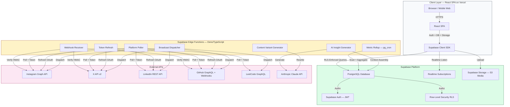
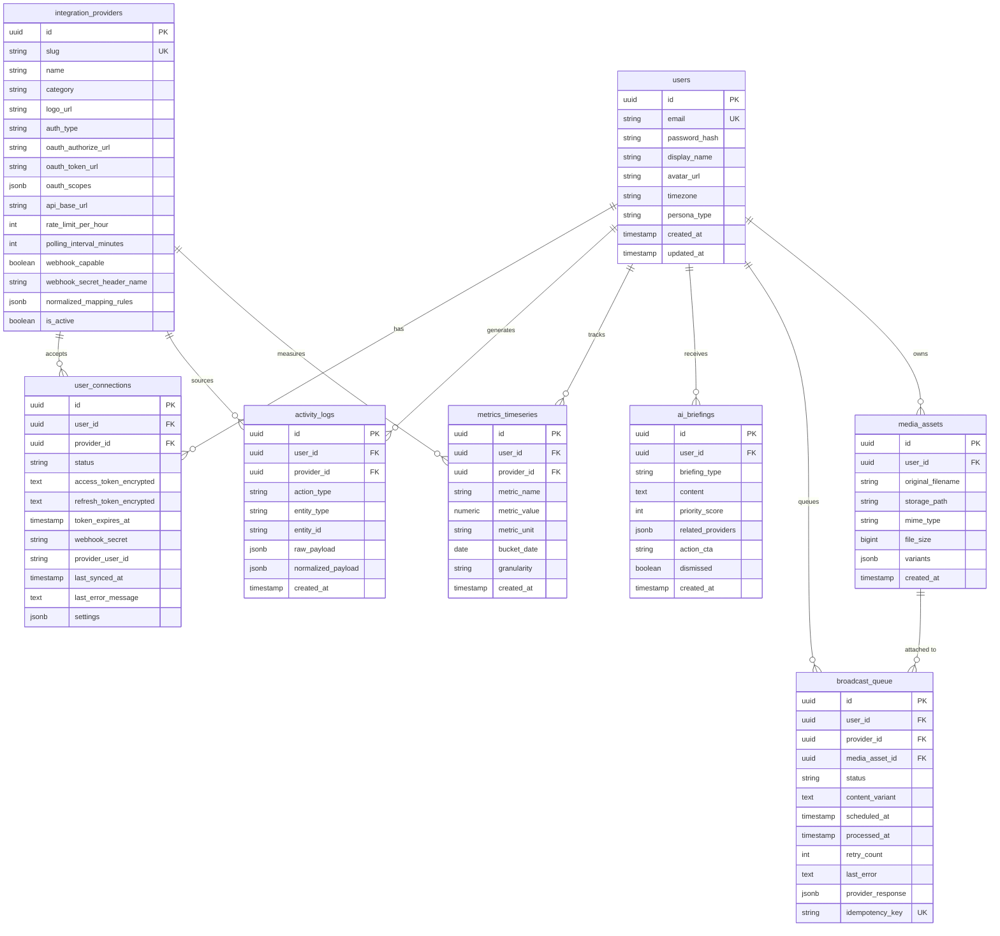

# Synalytix Core Architecture Skill

## 1. System Topology & Data Flow



### Data Flow Rules
- Frontend reads go directly to Supabase PostgreSQL via RLS policies. No backend proxy for reads.
- Frontend writes go through RLS or Edge Functions for operations requiring secrets (tokens, AI calls, external API dispatch).
- Platform data enters via two paths:
  - Polling: Edge Functions run on schedule (pg_cron triggers) to call platform APIs with stored tokens.
  - Webhooks: Real-time events from GitHub/X push to Edge Function endpoints; HMAC-verified and written to activity_logs.
- Token vault: `user_connections` stores encrypted OAuth tokens. Edge Functions decrypt with AES-256-GCM using env-injected master key.
- Metric normalization: Raw platform events land in `activity_logs`. A pg_cron job rolls them into `metrics_timeseries` using the canonical taxonomy.
- AI insights: Scheduled Edge Function assembles user context from `metrics_timeseries` + `activity_logs`, calls Claude API, stores results in `ai_briefings`.
- Cross-posting: Frontend uploads to `media_assets` → calls generate-variants Edge Function → user approves → `broadcast_queue` rows created → broadcast-dispatcher Edge Function locks rows with `FOR UPDATE SKIP LOCKED` and dispatches to each platform API.
- Concurrency: Broadcast worker uses row-level locking to prevent duplicate sends. Each row carries an `idempotency_key`.

## 2. Database Schema & Entity-Relationship Graph



### Schema Constraints & Indexes
- **Multi-tenancy via RLS:** Every table has `user_id`. PostgreSQL RLS policies enforce `auth.uid() = user_id` on all tenant tables.
- **Unique constraints:** `users.email`, `integration_providers.slug`, `user_connections(user_id, provider_id)` — one connection per user per platform, `broadcast_queue.idempotency_key`.
- **Partitioning:** `activity_logs` is range-partitioned by `created_at` month for append-only event stream scalability.
- **Indexes:**
  - `activity_logs`: BRIN on `created_at` (efficient for append-only time series), B-tree composite on `(user_id, provider_id, created_at)`.
  - `metrics_timeseries`: B-tree on `(user_id, provider_id, metric_name, bucket_date)` for fast dashboard queries.
  - `ai_briefings`: B-tree on `(user_id, dismissed, priority_score DESC)` for inbox loading.
  - `broadcast_queue`: B-tree on `(user_id, status, scheduled_at)` for worker polling.
- **Encryption:** `user_connections.access_token_encrypted` and `refresh_token_encrypted` use AES-256-GCM. The master key is injected via Supabase Edge Function environment variables (`SUPABASE_ENCRYPTION_KEY`). Never stored in the database.

## 3. Core Algorithms & Business Logic

### 3.1 Metric Normalization Engine
**Purpose:** Translate heterogeneous platform metrics into a canonical taxonomy for unified analytics.

**Canonical Metrics:**
| Canonical Metric    | Instagram       | X                       | LinkedIn                | GitHub             | LeetCode                |
| ------------------- | --------------- | ----------------------- | ----------------------- | ------------------ | ----------------------- |
| `audience_size`     | Followers       | Followers               | Connections + Followers | Stars + Watchers   | N/A                     |
| `content_volume`    | Posts           | Tweets                  | Articles + Posts        | Commits + PRs      | Problems Solved         |
| `engagement_rate`   | Likes/Reach     | Engagements/Impressions | Reactions/Views         | Stars/Week + Forks | Contest Rank %ile       |
| `consistency_score` | Posting streak  | Tweet streak            | Weekly post count       | Commit streak      | Daily submission streak |
| `growth_velocity`   | Follower %/week | Follower %/week         | Profile view %/week     | Star velocity      | Rating delta/month      |
| `quality_signal`    | Save rate       | Bookmark rate           | Comment depth           | PR merge rate      | Acceptance rate         |

**Algorithm:**
- **Ingest:** Platform-specific payloads land in `activity_logs.raw_payload`.
- **Map:** Edge Function applies `integration_providers.normalized_mapping_rules` (JSONB path maps) to extract raw values.
- **Transform:** Apply platform-specific conversion factors:
  - Instagram `engagement_rate` = (likes + comments + saves) / reach
  - X `engagement_rate` = (retweets + replies + bookmarks) / impressions
  - LinkedIn `engagement_rate` = (reactions + comments + shares) / impressions
  - GitHub `engagement_rate` = (stars_this_week + forks) / watchers
  - LeetCode `engagement_rate` = contest_rating_percentile
- **Store:** Write normalized `(user_id, provider_id, metric_name, metric_value, bucket_date, granularity)` to `metrics_timeseries`.
- **Rollup:** pg_cron job runs hourly to aggregate `activity_logs` into `metrics_timeseries` with granularity = 'day'. Weekly and monthly rollups are computed on-read from daily rows to avoid stale pre-aggregation.

### 3.2 Digital Presence Score (DPS)
**Purpose:** A flagship composite metric (0–1000) representing the user's entire digital identity strength.

**Weighting:**
| Platform  | Weight | Rationale                                                   |
| --------- | ------ | ----------------------------------------------------------- |
| LeetCode  | 25%    | Raw problem-solving ability; most quantitative signal       |
| GitHub    | 25%    | Proof of building real things; most credible for recruiters |
| LinkedIn  | 20%    | Professional network and visibility; the hiring pipeline    |
| X         | 15%    | Thought leadership and community engagement                 |
| Instagram | 15%    | Personal brand and visual storytelling; the human layer     |

**Algorithm:**
- **Fetch:** For each platform, retrieve the latest `metrics_timeseries` rows for all 6 canonical metrics.
- **Platform Subscore (0–200 each):**
  - `audience_size`: Log-scaled percentile vs. peer cohort (same `persona_type`, e.g., "student"). Max 40 pts.
  - `content_volume`: Weekly volume percentile. Max 40 pts.
  - `engagement_rate`: Raw rate vs. platform median. Max 40 pts.
  - `consistency_score`: Streak length (max 30 days = full points). Max 30 pts.
  - `growth_velocity`: Week-over-week growth percentile. Max 30 pts.
  - `quality_signal`: Quality metric percentile. Max 20 pts.
- **Composite:** DPS = Σ (platform_subscore × weight).
- **Tier Interpretation:**
  - 0–400: Building foundations. Focus on consistency.
  - 400–650: Emerging presence. Startup internship ready.
  - 650–850: Strong digital identity. Tier-2 / mid-tier ready.
  - 850–1000: Authority. FAANG-ready; recruiters likely already find you.
- **Trend Analysis:** AI advice uses DPS delta (30-day change), not absolute value. Store historical DPS in `metrics_timeseries` with `metric_name = 'digital_presence_score'`.

### 3.3 Cross-Post Studio — Content Variant Generation
**Purpose:** Auto-rewrite a single piece of content into 5 platform-native variants.

**Algorithm:**
- **Input:** User provides base text + optional media upload. Frontend stores media in `media_assets` with `variants = {}`.
- **Media Resizing:** Edge Function `generate-variants` calls an image processing worker (or Sharp WASM) to create platform-optimal derivatives:
  - Instagram: 1080×1350 (4:5 portrait), dark mode aesthetic
  - X: 1200×675 (16:9), WebP
  - LinkedIn: 1200×627 (1.91:1), infographic-friendly
  - GitHub: Architecture diagrams, code snippets (no resize needed)
  - LeetCode: Formatted code blocks (no resize needed)
- **Prompt Assembly:** Construct structured prompt for Claude API:
```json
{
  "System": "You are a platform-native content rewriter. Output strict JSON.",
  "Input": "{base_text}",
  "Platforms": ["instagram", "x", "linkedin", "github", "leetcode"],
  "Rules_per_platform": "[tone, structure, CTA constraints from taxonomy table]",
  "Output_format": "{ \"instagram\": \"...\", \"x\": \"...\", \"linkedin\": \"...\", \"github\": \"...\", \"leetcode\": \"...\" }"
}
```

### 3.5 AI Insight Engine
- **Prompt:**
```text
System: You are Synalytix AI, a personal brand advisor. Analyze the user's five-platform data and generate 3 actionable insights. Be specific, use numbers, and suggest one concrete action per insight.
Categories: Authenticity Gap, Optimal Rhythm, Career Trajectory, Cross-Platform Synergy, Contest Intelligence.
Output: JSON array of { category, title, content, priority_score (0-100), action_cta, related_providers }.
```
- **Model Call:** `claude-3-5-sonnet`, temperature=0.4, max tokens 1500.
- **Store:** Write to `ai_briefings` with `briefing_type = 'daily'`. Set `priority_score` from model output.
- **Weekly & Contest Variants:** Separate scheduled jobs assemble longer time windows (30 days for weekly, contest calendar for contest briefings) and store with `briefing_type = 'weekly'` or `'contest'`.
- **Dismissal:** Frontend sets `dismissed = true`. RLS ensures users only dismiss their own briefings.

### 3.6 Placement Readiness Algorithm
**Purpose:** Translate LeetCode + GitHub + LinkedIn data into hiring intelligence for students.

**Algorithm:**
- **Input Vectors:**
  - LeetCode Hard ratio + topic diversity: 25%
  - LeetCode rating + contest percentile: 20%
  - GitHub repos + stars + commit consistency: 25%
  - LinkedIn connections + post engagement: 20%
  - X + Instagram follower growth + consistency: 10%
- **Benchmark Comparison:** Compare user vectors against anonymized cohort data for target tiers:
  - **Tier-1 (FAANG):** Median 400+ problems, 15+ repos with 100+ stars, 1200+ connections, 800+ DPS.
  - **Tier-2 (Mid-tier):** Median 250+ problems, 8+ repos with 20+ stars, 600+ connections, 650+ DPS.
  - **Startup:** Median 150+ problems, 5+ repos with 5+ stars, 300+ connections, 400+ DPS.
- **Gap Analysis:** For each vector, compute gap = `(benchmark_median - user_value) / benchmark_median`. Rank gaps by weight.
- **Readiness Score:** readiness = `100 - Σ(gap × weight)`. Clamp to 0–100.
- **Output:** Store as `ai_briefings` with `briefing_type = 'career'`. Content format: "You are 73% Tier-1 ready. Your biggest gap is network size (LinkedIn). Spend 30 minutes daily on engagement."
- **Contest Prediction:** Use recent 30-day LeetCode submission patterns (topic distribution, accuracy, time-of-day) to predict expected solve count in upcoming contests. Store as `ai_briefings` with `briefing_type = 'contest'`.

## 4. Security Architecture

| Threat                     | Mitigation                                                                                                                                                           |
| -------------------------- | -------------------------------------------------------------------------------------------------------------------------------------------------------------------- |
| **Token theft at rest**    | AES-256-GCM encryption in `user_connections`. Master key in Edge Function env vars only.                                                                             |
| **CSRF on OAuth callback** | Cryptographic `state` parameter — JWT nonce with `aud=oauth_callback`, verified before token exchange.                                                               |
| **Webhook spoofing**       | HMAC-SHA256 verification per platform using stored `webhook_secret`. Reject if signature mismatch.                                                                   |
| **SQL injection**          | Supabase parameterized queries + RLS policies. No raw SQL construction from user input.                                                                              |
| **RLS bypass**             | All tables have RLS enabled. Policies: `USING (auth.uid() = user_id)`. No service role key exposed to frontend.                                                      |
| **Rate limiting**          | Platform API rate limits tracked per `user_connections`. Redis counter (or Supabase `rate_limit` table) enforces `rate_limit_per_hour` from `integration_providers`. |
| **Media abuse**            | Supabase Storage bucket size limits per user. MIME type whitelist. Virus scan via ClamAV Edge Function (optional).                                                   |
| **AI prompt injection**    | User content is escaped in prompts. System prompt instructions are fenced. Output is JSON-schema-validated before storage.                                           |

## 5. Performance & Scaling Notes
- **Database:** `activity_logs` partitioned monthly prevents table bloat. BRIN index on `created_at` is O(1) for time-range scans.
- **Polling strategy:** Stagger platform polls to avoid thundering herd. Use `last_synced_at + polling_interval_minutes` as the trigger condition.
- **Realtime:** Use Supabase Realtime for live dashboard updates (new activity log inserted → push to client). Limit to 100 events/second per channel.
- **Edge Functions:** Keep execution under 50s (Supabase limit). Long jobs (bulk import) split into batches and return 202 Accepted with polling URL.
- **Caching:** `metrics_timeseries` daily rows cached in React Query for 5 minutes. `ai_briefings` cached for 1 minute (they update nightly).
- **Media variants:** Generated on-demand and stored in Supabase Storage. Original + 3 variants max per asset. Auto-delete variants after 30 days if unused.

## 6. Integration Rules for Agents
When this skill is loaded:
- Always use Supabase as the platform (PostgreSQL + Auth + Storage + Edge Functions + Realtime). Do not introduce a separate Node.js backend or tRPC unless explicitly scaling beyond Supabase limits.
- Always use the exact table names and column names from Section 2.
- Always enforce RLS policies with `auth.uid() = user_id` on every tenant table.
- Never store OAuth tokens in plaintext. Always encrypt with AES-256-GCM.
- Never construct SQL from user input. Use Supabase client SDK or parameterized Edge Function queries.
- Always include `idempotency_key` on `broadcast_queue` inserts.
- Always validate Claude API output as JSON before writing to `ai_briefings`.
- Prefer Deno/TypeScript for Edge Functions. Use `supabase/functions/` directory structure.
- Use the canonical metric taxonomy from Section 3.1 for all analytics calculations. Do not invent new metric names.
- Respect platform rate limits stored in `integration_providers.rate_limit_per_hour`.
